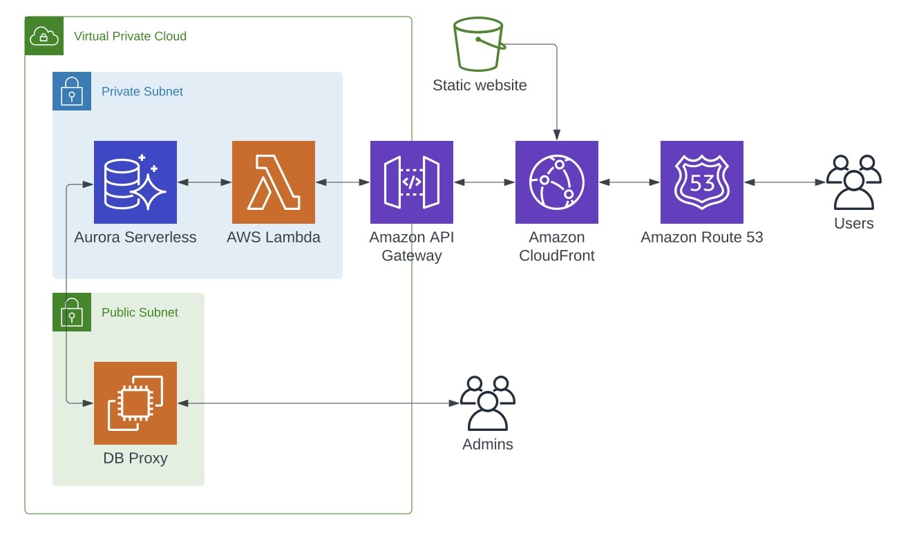
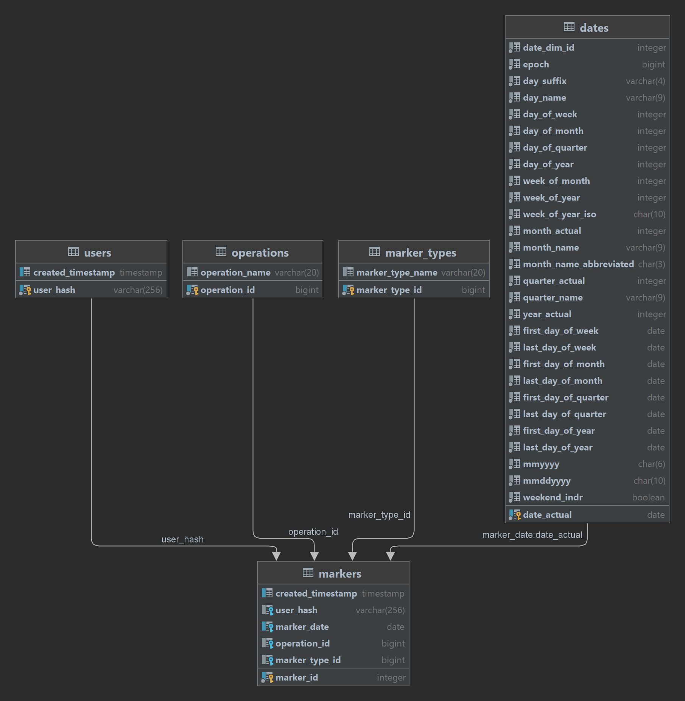

# Aphrodite

## What is this?

## Infrastructure



The infrastructure is pretty straight forward. The web app will be deployed to an S3 bucket as a
static website distributed via CloudFront. The site makes HTTP requests to and API Gateway endpoint,
which triggers lambda functions that interact with an Aurora serverless cluster. Admins will have
the ability to use an SSH tunnel to connect directly to the cluster. You can follow the creation of
all these resources starting from `bin/aphrodite.ts`.

## API

### Endpoints

| Endpoint                     | Stage |
|------------------------------|-------|
| api.betaaphrodite.ksco92.com | beta  |
| TBD                          | prod  |

### Operations

#### `/create_user`
* **Method:** `POST`
* **Inputs:**
  * None
* **Outputs:**

```json
{
    "user_hash": "a new user hash"
}
```

#### `/get_user`
* **Method:** `GET`
* **Inputs:**
  * User hash as a query string. 
  * User hashes use a lot of special characters, so you will have to do something like this to encode it:

```python
import urllib.parse
safe_string = urllib.parse.quote_plus(...)
print(safe_string)
```
And then send the request as `/get_user?user_hash=the_encoded_hash`.

  * **Outputs:**

```json
{
    "user": [
        {
            "user_hash": "the_user_hash",
            "created_timestamp": "2022-07-04 02:18:30.324661"
        }
    ]
}
```

#### `/add_marker`
* **Method:** `POST`
* **Inputs:**

```json
{
    "user_hash": "the_user_hash",
    "marker_date": "2022-01-09",
    "operation_id": "1",
    "marker_type_id": "1"
}
```

* **Outputs:**

```json
{
    "message": "Marker added."
}
```

### Database



Creation of all the DB objects is in `lib/database/create_db.sql`


